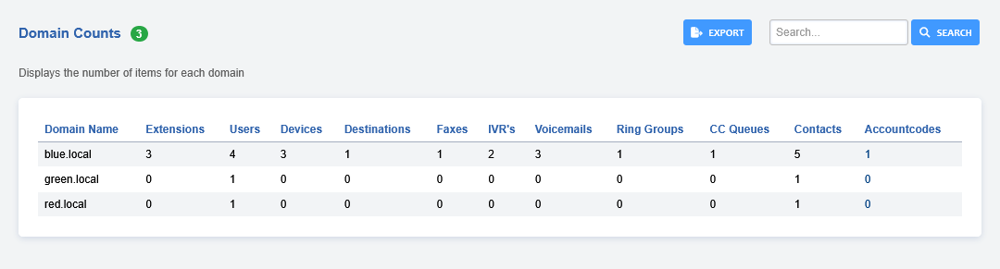

# Domain Counts

Totals the number of configured extensions, voicemail boxes, ring groups and the like per Domain, with the ability to export all this data to a CSV so you can open it in your favorite spreadsheet software!



## Installation
This was tested with FusionPBX 5.6 (current master at time of writing) and will likely work on newer or slightly older versions of FusionPBX.

Clone the FusionPBX-Apps repo into the working path after SSHing/Moshing into your server:

```
cd /var/www/fusionpbx/app
git clone https://github.com/fusionpbx/fusionpbx-apps-domain_counts domain_counts
php /var/www/fusionpbx/core/upgrade/upgrade.php
chown -R www-data:www-data /var/www/fusionpbx/app/domain_counts
```

Then navigate to **Advanced** > **Upgrade**. Run **Menu Defaults** and **Permission Defaults**.

Log out and back into your FusionPBX installation.   

You will now see **Domain Counts** under menu **Status**.
